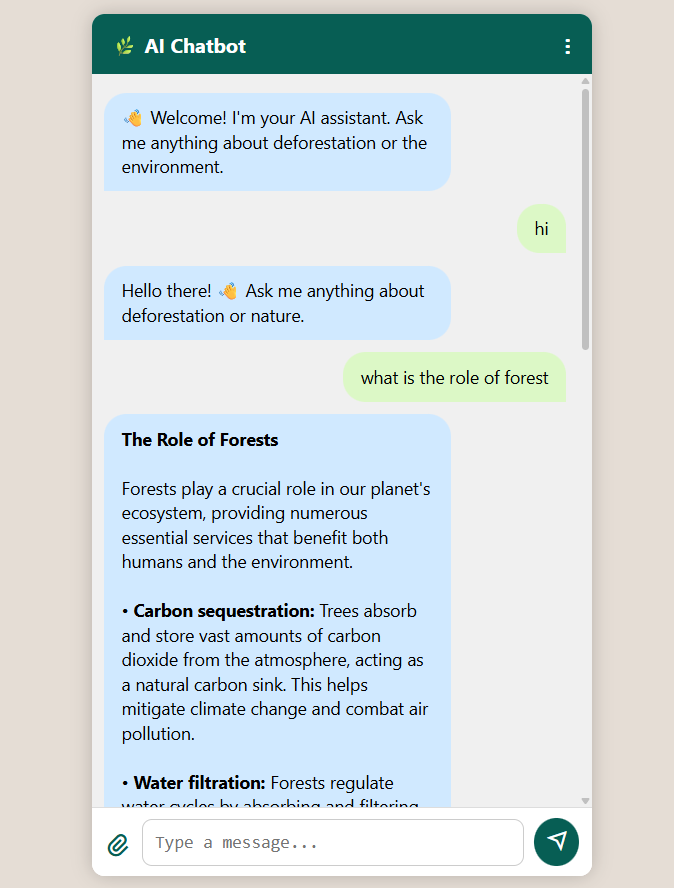

Deforestation Detection & Awareness Chatbot
===========================================

An AI-powered chatbot built using Node.js, Express, MongoDB, and Ollama (Gemma 2) that allows users to ask questions about deforestation, upload satellite images for forest fire or deforestation detection (placeholder logic), and automatically send alerts via email to forest authorities. The frontend is created with plain HTML, CSS, and JS with a responsive design and multilingual support (English, Hindi, Spanish, French, German, Hinglish). MongoDB is used for storing chat history and Nodemailer for sending email alerts.

---

Features: 
- Smart AI chatbot for deforestation awareness using Ollama (Gemma 2)
- Satellite image upload with AI-based (placeholder) detection  (yet to introduce)
- Email alerts to authorities when detection triggers (yet to introduce)
- Language translation between 6 languages using MyMemory API
- Responsive UI with scroll effects, image support, typing indicator, and emoji responses
- Chat history stored in MongoDB

---

How to Run:

1. Install dependencies  
   > npm install

2. Pull and run Ollama model  
   > ollama pull gemma:2b  
   > ollama run gemma:2b

3. Create a `.env` file with the following:  
   PORT=5000  
   MONGO_URI=""  
   EMAIL_USER=your_email@example.com  
   EMAIL_PASS=your_email_password_or_app_password  

4. Start the development server  
   > npm run dev

5. Visit in your browser:  
   http://localhost:5000

---

Project Structure:

- public/         → Frontend assets (HTML, JS, CSS)  
- server/         → Express app: routes, controllers, middleware  
- utils/          → Ollama AI logic, translation API integration, email logic  
- uploads/        → Image uploads for satellite detection 
- .env            → Stores environment variables (not committed)  
- .env.example    → Template for your .env file
- package.json    → Scripts and project metadata

---

Scripts:

- npm run dev       → Start server with nodemon  
- npm start         → Start server normally  

---

